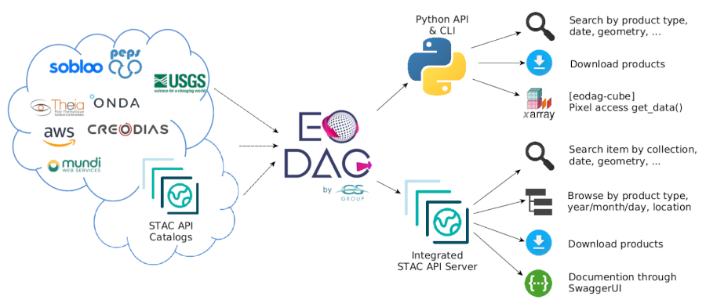

=====
Eoian
=====

`Eoain <https://github.com/ECHOESProj/eoian>`_  was developed to automate the processing of satellite data. It can work with data stored on `CREODIAS <https://creodias.eu/>`_, `Mundi <https://mundiwebservices.com/>`_ and `AWS <https://aws.amazon.com/>`_. It has been tested on CREODIAS.

`Eoain <https://github.com/ECHOESProj/eoian>`_ accesses the data on the object store, processes it an stores it. `CREODIAS <https://creodias.eu/>`_ has data (in an object store) that is not available on Sentinel-Hub. Also, we may want to process that data using SNAP or some other software. Eoin automates this processing.

Firstly, check out the code from the repository (see code :ref:`Clone the repository`).

The easiest way to run code is using Docker (see :ref:`Run with Docker`). This way, the code will run on Windows or Linux without the need set up the environment. Alternatively, see :ref:`Install with PIP`, for installation using PIP, which the recommended way for developing the code further.

The code can run on a local computer; however, it will run faster on a platform the source data in its data store, such as CREODIAS. When run locally the EO data is downloaded from CREODIAS and so a slow connection will results in long processing times.

===============
Developer Guide
===============

This section is for anyone who would like to develop the code further, as opposed to just run existing processing chains.

Processing Steps
----------------

Processing is performed on the source satellite. The satellited data is processed to create level 2 products, such as NDVI.

There are three steps preformed by Eoin:

1. :ref:`Transfer source EO data to VM`
2. :ref:`Process data`
3. :ref:`Store data`

Transfer source EO data to VM
*****************************

The first step is to search and download the satellite data. This is done using a Python library called `EODAG <https://eodag.readthedocs.io/en/stable/>`_.

EODAG can be used to search for data in a number of platforms.

The code to search for the source data is eoian/core/sourcedata.py.

Process data
************

The code for processing the source data is in eoian/core/processors.

The module eoian/core/processors/process.py imports the module specifed in the CLI (:ref:`cli.rst`).

The module eoian/core/processors/gpt.py is used to run `SNAP graphs <http://step.esa.int/docs/tutorials/SNAP_CommandLine_Tutorial.pdf>`_.

The eoian/core/processors/satpy_env contains processors which use `Satpy <https://satpy.readthedocs.io/en/stable/>`_ to read the satellite data.

Store data
**********

The data is stored in an object store (see :ref:`Object Store`). If the code is run on CREODIAS the data will be stored on its object store. If it is run on a local machine `minio <https://min.io/>`_ can be used.

