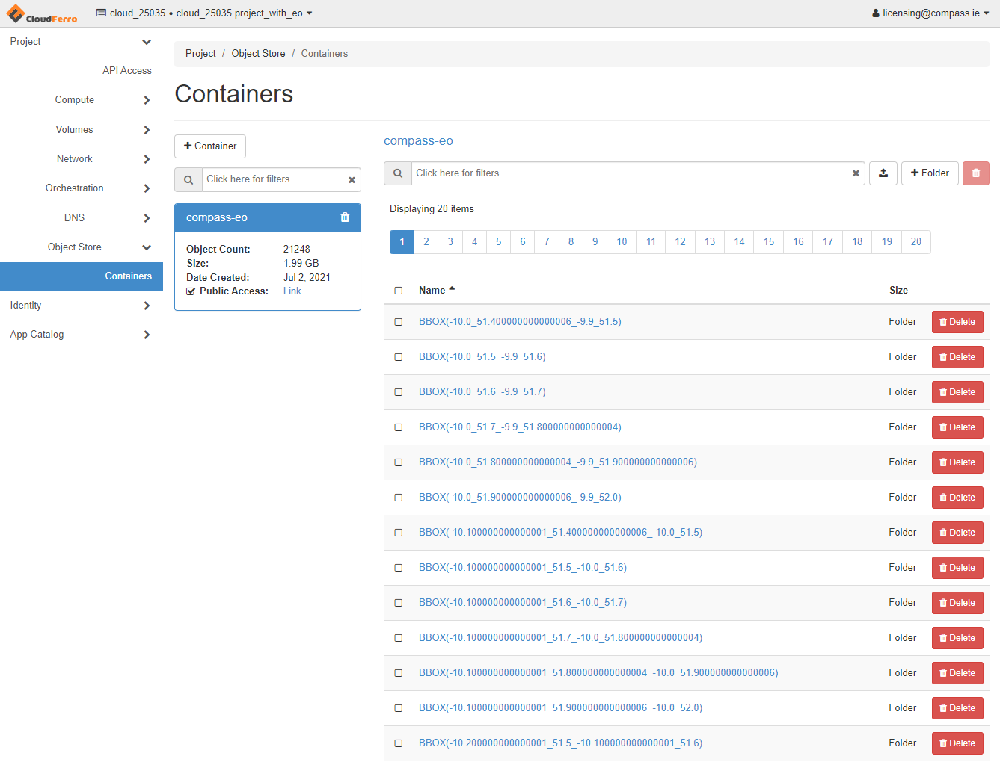

============
Object Store
============

The GeoTIFFs generated by the processing is stored in the object store. The path that the are stored in is automatically generated, with the following format:

<WKT bounding box>/<product>/<source object location>,

where the ``WKT bounding box`` is modified so that it can be saved as a path and ``source object location`` is the location of the source data on CREODIAS' EO object store.

Here is an example:

POLYGON_((-6.485367_52.328206!_-6.326752_52.328206!_-6.326752_52.416241!_-6.485367_52.416241!_-6.485367_52.328206))/ndvi_s2/Sentinel-2/MSI/L1C/2021/01/25

where running on CREODIAS,

CREODIAS Object Store
---------------------

Minio
-----

